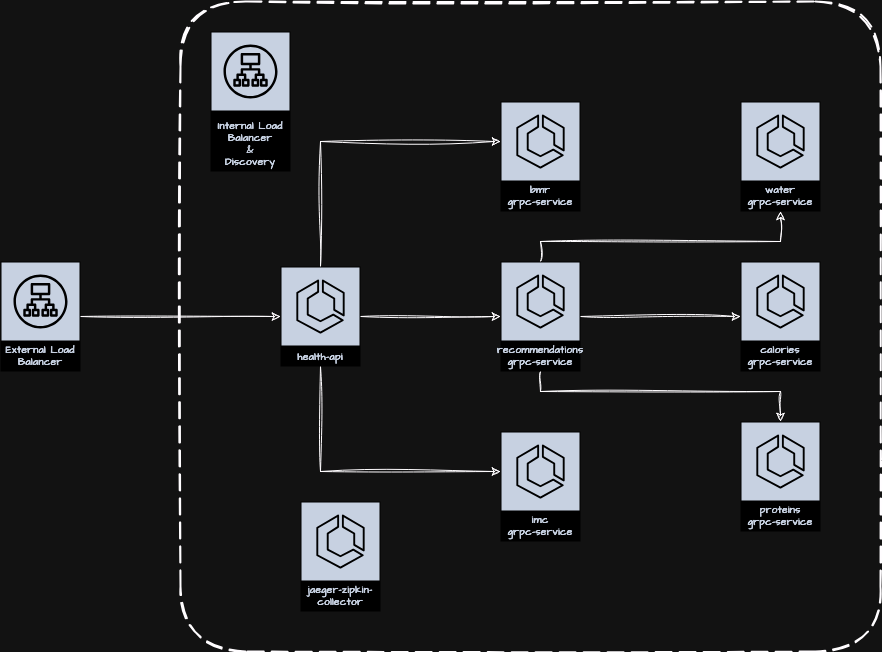
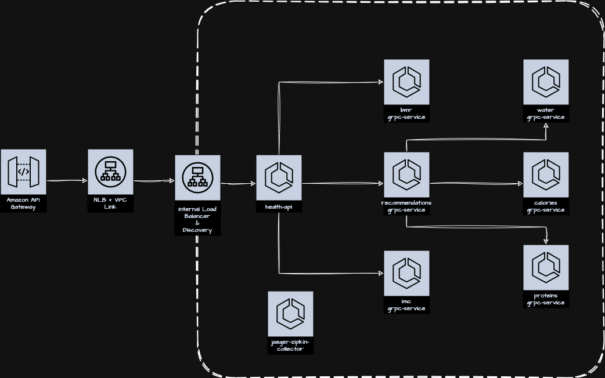

# aws-ecs-health-api

Microservices lab for the Health API on ECS, built on top of the ECS service module.

## [v1] - Internal and external routing

The goal is to stand up an environment with distributed communication between several internal and external microservices inside AWS.



```bash
curl --location --request POST 'http://health.demo/calculator' \
--header 'Content-Type: application/json' \
--data-raw '{ 
   "age": 26,
   "weight": 90.0,
   "height": 1.77,
   "gender": "M", 
   "activity_intensity": "very_active"
} ' --silent | jq .
```

## [v2] - API Gateway and VPC Link for external exposure

